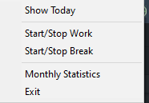
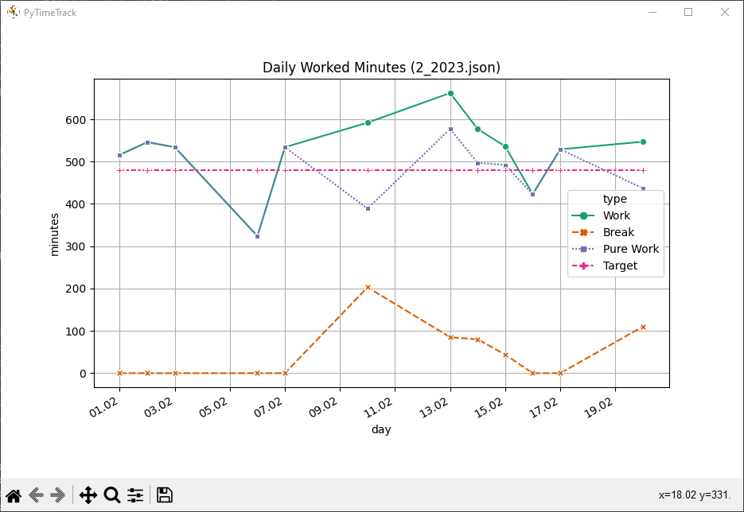

# PyTimeTrack
Your minimalistic time tracking tool.

It lives in your tray:



tracks your time in a data format that is easy to read and to manually adapt if necessary:

```json
{
    "01.02.2023": {
        "start": "07:11",
        "end": "15:47",
        "breaks": [],
        "comment": "",
    },
    "02.02.2023": {
        "start": "06:49",
        "end": "19:12",
        "breaks": ["14:41", "16:06", "18:12", "18:23"],
        "comment": "",
    },
    "03.02.2023": {
        "start": "06:49",
        "end": "19:12",
        "breaks": [],
        "comment": "",
    },
    "04.02.2023": {
        "start": "00:02",
        "end": "04:12",
        "breaks": [],
        "comment": "",
    }
}
```

and visualizes the data to help you keep track:



## Configuration
You can configure PyTimeTracker to your needs using the [config.toml](./config.toml).

| Section | Param | Description |
| ------- | ----- | ----------- |
| work | target_daily_work_minutes | The amount of minutes you have to work per day. |
| work | default_break_after_6h | Amount of minutes to include after 6h of work. Set to `0` to deactivate. |
| work | default_break_after_9h | Amount of minutes to include after 9h of work.  Set to `0` to deactivate.|
| paths | reports | The path to a folder where the reports shall be stored. Point this e.g. to a local cloud storage folder for automated backups. |
| development | devmode | Activates (if set to true) the development mode only necessary when developing features for this app. |

To use another custom config TOML, see [Arguments](#arguments).

## Tested Platforms

### Windows
PyTimeTrack is for now only tested on **Windows**, should however be compatible to other platforms as well.
Just try to build it your own using PyInstaller (see [build_win.ps1](build_win.ps1)). If you needed to do adoptions, open an Pull Request and I'll review it. 

On Windows you can add PyTimeTrack to your startup routine [like this](https://support.microsoft.com/en-us/windows/add-an-app-to-run-automatically-at-startup-in-windows-10-150da165-dcd9-7230-517b-cf3c295d89dd).

## How to Release

1. Update Changelog
2. Merge to main
3. Build and attach
4. Tag