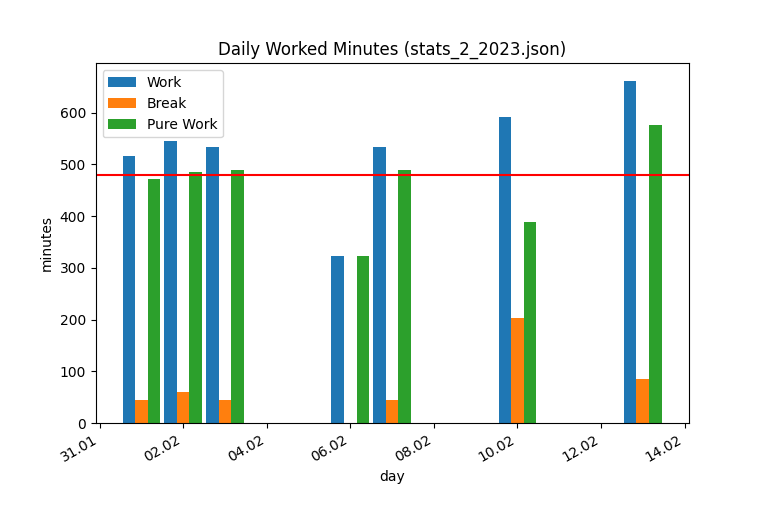

# PyTimeTrack
Your minimalistic time tracking tool.

It helps you track your time in data format that is easy to read and to manipulate:

```json
{
    "01.02.2023": {
        "start": "07:11",
        "end": "15:47",
        "breaks": [],
        "comment": "",
    },
    "02.02.2023": {
        "start": "06:49",
        "end": "19:12",
        "breaks": ["14:41", "16:06", "18:12", "18:23"],
        "comment": "",
    },
    "03.02.2023": {
        "start": "06:49",
        "end": "19:12",
        "breaks": [],
        "comment": "",
    },
    "04.02.2023": {
        "start": "00:02",
        "end": "04:12",
        "breaks": [],
        "comment": "",
    }
}
```

and helps you keep track with visualizations:



## Arguments

| Argument | Description |
| -------- | ----------- |
| --config | Name of a custom config file to use. |
| --workbreak | Track the start/stop of a work break. |
| --stats | Create statistics for the given report. For the current report of this month use the keyword `current`. |

## Configuration
You can configure PyTimeTracker to your needs using the [config.toml](./config.toml).

| Section | Param | Description |
| ------- | ----- | ----------- |
| work | target_daily_work_minutes | The amount of minutes you have to work per day. |
| work | default_break_after_6h | Amount of minutes to include after 6h of work. Set to `0` to deactivate. |
| work | default_break_after_9h | Amount of minutes to include after 9h of work.  Set to `0` to deactivate.|
| paths | reports | The path to a folder where the reports shall be stored. |
| development | devmode | Activates (if set to true) the development mode only necessary when developing features for this app. |

To use another custom config TOML, see [Arguments](#arguments).

## Building the executable
PyInstaller is used for building the executable 
(notice, that it still needs the `__init__.py` files in each module even if Python itself doesn't need it anymore since version 3.3+).